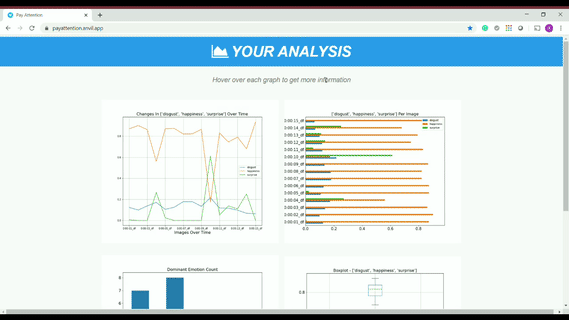

# PayAttention - Emotion Detection Video Analysis Tool

With the recent increased usage in video conferencing, many people have been able to communicate with coworkers from the comfort of their home. However, video conferencing loses some of the key physical cues that people use to properly and fully communicate with each other. Thus, the limitations of video conference calls can lead to a decrease in team productivity. PayAttention aims to alleviate these problems by allowing people to better understand each other. 

In-person communications allow us to read each other’s body language which we unconsciously interpret as emotional communication. PayAttention helps you understand a team’s emotional response to your slides, talking-points, and feedback. Simply upload your video, select your preferences and receive immediate results! 

## How to use PayAttention:

### Option 1 - Web-App (preffered)

To get PayAttention to work as a fully functioning WebApp follow these simple steps:
1. Download the PayAttention_BackEnd_NoteBook.ipynb file
2. Open with Google Colab
3. Run through the 3 Notebook Sections
      - Install packages
      - Connect to front end web app
      - Use the provided link to go to the WebApp
     
### Option 2 - Interactive Notebook

You can also use PayAttention via an interactive notebook with precoded widgets:
1. Download the PayAttention_Interactive_NoteBook.ipynb file
2. Open with Google Colab
3. Run through Notebook Sections:
      - Install packages
      - Runctions
      - Notebook UI
      - Results cell
      
===========================================================

Packages used:
- face_recognition
- Pillow
- EmoPy
- opencv-python
- anvil-uplink

Code to shade images taken from William Chargin of Khan Academy.
- His code: https://gist.github.com/WChargin/d8eb0cbafc4d4479d004
- Article about his code: http://engineering.khanacademy.org/posts/making-thumbnails-fast.htm

Additional Content:
- Full Recorded demo
- Features in development - Color to Emotion EDA

===========================================================

Authors:
- Raz Friedman (r.friedman@berkeley.edu)
- Matthew Forbes (mforbes97@berkeley.edu)
- Wesley Kwong (weskwong2@ischool.berkeley.edu)
