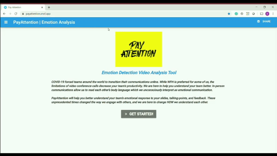

# PayAttention - Emotion Detection Video Analysis Tool

COVID-19 forced teams around the world to transition their communications online. While Work from home is preferred for some of us, the limitations of video conference-calls decrease your team's productivity. We are here to help you understand your team better. In-person communications allow us to read each other’s body language which we unconsciously interpret as emotional communication.

PayAttention will help you better understand your team’s emotional response to your slides, talking-points, and feedback. These unprecedented times changed the way we engage with others, and we are here to change HOW we understand each other.

## How to use PayAttention:

### Option 1 - Web-App (preffered)

To get PayAttention to work as a fully functioning WebApp follow these simple steps:
1. Download the PayAttention_BackEnd_NoteBook.ipynb file
2. Open with Google Colab
3. Run through the 3 Notebook Sections
      - Install packages
      - Connect to front end web app
      - Use the provided link to go to the WebApp
     
### Option 2 - Interactive Notebook:

You can also use PayAttention via an interactive notebook with precoded widgets:
1. Download the PayAttention_Interactive_NoteBook.ipynb file
2. Open with Google Colab
3. Run through Notebook Sections:
      - Install packages
      - Runctions
      - Notebook UI
      - Results cell
      
===========================================================

Packages used:
- face_recognition
- Pillow
- EmoPy
- opencv-python
- anvil-uplink

Additional Content:
- Full Recorded demo
- Features in development - Color to Emotion EDA

===========================================================

Authors:
- Raz Friedman (r.friedman@berkeley.edu)
- Matthew Forbes (mforbes97@berkeley.edu)
- Wesley Kwong (weskwong2@ischool.berkeley.edu)
